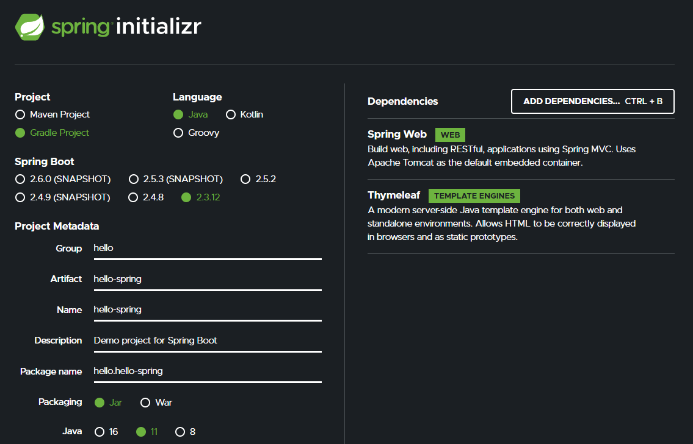
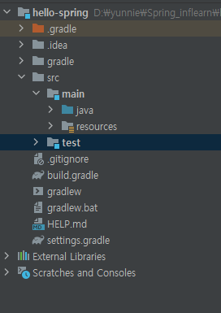
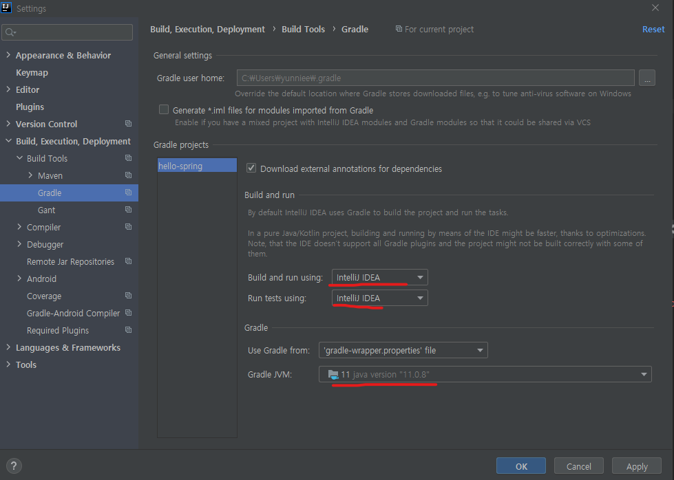
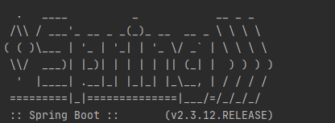
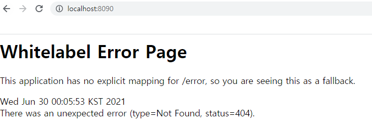

## 0629_프로젝트 환경설정

### ⚒ 프로젝트 생성

* Java11
* IDE: IntelliJ

**[Springboot 사이트]**

https://start.spring.io/

**[빌드 관리 툴]**

#### Maven , Gradle

> 의존관리를 관리해줌
>
> Maven : 필요한 라이브러리를 특정문서(pom.xml)에 정의해 놓으면 네트워크를 통해 라이브러리들을 자동으로 다운 받아줌, 단, pom.xml에 프로젝트에 대한 내용이 담겨서 길고 장황하게 될 수 있음
>
> Gradle : Maven보다 나중에 나온 것으로 maven의 단점을 보완, 빌드 스크립트를 간단하게 작성 가능

**[IntelliJ에서 build.gradle open]**

> main, test나눠져 있음 ! -> Test가 중요해짐! -> Test는 JUnit5 default
>
> build.gradle을 들어가보면 설정파일이 자동으로 제공되고 있음을 알고 있음!(Spring은 수동으로 작성!)

> 설정에서 build랑 run IntelliJ에서 실행하도록 수정

**[실행 된 모습]**

## 📢 라이브러리 살펴보기

* Dependencies로 관련 라이브러리를 자동으로 다운받아줌

**스프링 부트 라이브러리**

* `spring-boot-starter-web`
  * `spring-boot-starter-tomcat`: 톰캣(웹서버)
  * `spring-webmvc` : 스프링 웹 MVC
* `spring-boot-starter-thymeleaf`: 타임리프 템플릿 엔진(View)
* `spring-boot-starter(공통)`: 스프링 부트 + 스프링 코어 + 로깅
  * `spring-boot`
    * spring-core
  * `spring-boot-starter-logging`
    * logback, slf4

**test라이브러리**
* `spring-boot-starter-test`
  * `junit`: 테스트 프레임워크
  * `mockito` : 목 라이브러리
  * `assertj` : 테스트 코드를 좀 더 편하게 작성하게 도와주는 라이브러리
  * `spring-test`: 스프링 통합 테스트 지원

