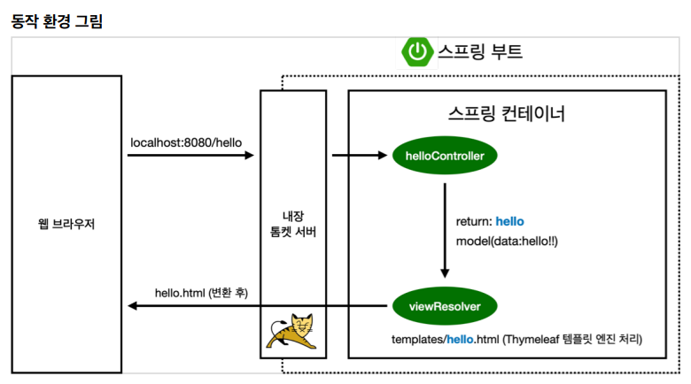
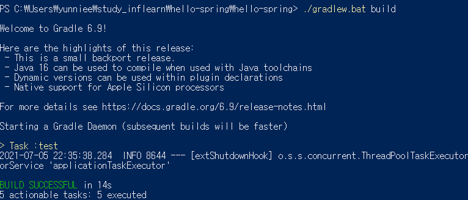
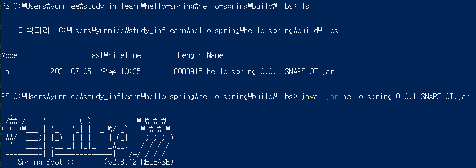

## 0629_프로젝트 환경설정

### ⚒ 프로젝트 생성

* Java11
* IDE: IntelliJ

**[Springboot 사이트]**

https://start.spring.io/


**[빌드 관리 툴]**

#### Maven , Gradle

> 의존관리를 관리해줌
>
> Maven : 필요한 라이브러리를 특정문서(pom.xml)에 정의해 놓으면 네트워크를 통해 라이브러리들을 자동으로 다운 받아줌, 단, pom.xml에 프로젝트에 대한 내용이 담겨서 길고 장황하게 될 수 있음
>
> Gradle : Maven보다 나중에 나온 것으로 maven의 단점을 보완, 빌드 스크립트를 간단하게 작성 가능


**[IntelliJ에서 build.gradle open]**

> main, test나눠져 있음 ! -> Test가 중요해짐! -> Test는 JUnit5 default
>
> build.gradle을 들어가보면 설정파일이 자동으로 제공되고 있음을 알고 있음!(Spring은 수동으로 작성!)


> 설정에서 build랑 run IntelliJ에서 실행하도록 수정


**[실행 된 모습]**


## 📢 라이브러리 살펴보기

* Dependencies로 관련 라이브러리를 자동으로 다운받아줌

**스프링 부트 라이브러리**

* `spring-boot-starter-web`
  * `spring-boot-starter-tomcat`: 톰캣(웹서버)
  * `spring-webmvc` : 스프링 웹 MVC
* `spring-boot-starter-thymeleaf`: 타임리프 템플릿 엔진(View)
* `spring-boot-starter(공통)`: 스프링 부트 + 스프링 코어 + 로깅
  * `spring-boot`
    * spring-core
  * `spring-boot-starter-logging`
    * logback, slf4

**test라이브러리**
* `spring-boot-starter-test`
  * `junit`: 테스트 프레임워크
  * `mockito` : 목 라이브러리
  * `assertj` : 테스트 코드를 좀 더 편하게 작성하게 도와주는 라이브러리
  * `spring-test`: 스프링 통합 테스트 지원


**View 환경설정**

* Welcome Page 만들기

`resources\static\index.html`


* 스프링 부트가 제공하는 Welcome Page기능
  * `static/index.html`을 올려두면 Welcome Page 기능을 제공한다.
* 스프링 부트가 제공하는 기능을 찾아보고 싶으면 doc을 이용
* 스프링 부트 메뉴얼에서 검색해서 사용!
  * https://spring.io/ 

* thymeleaf 템플릿 엔진
  * https://www.thymeleaf.org/

* HelloController의 value값이 thymeleaf를 통해서 data로 치환

`[hello.hellospring\controller\HelloSpringApplication.java]`

```java
package hello.hellospring;

import org.springframework.boot.SpringApplication;
import org.springframework.boot.autoconfigure.SpringBootApplication;

@SpringBootApplication
public class HelloSpringApplication {

	public static void main(String[] args) {
		SpringApplication.run(HelloSpringApplication.class, args);
	}

}
```

`[templates\hello.html]`

```html
<!doctype html>
<html lang="en" xmlns:th="http://www.thymeleaf.org">
<head>
    <meta charset="UTF-8">
    <meta name="viewport"
          content="width=device-width, user-scalable=no, initial-scale=1.0, maximum-scale=1.0, minimum-scale=1.0">
    <meta http-equiv="X-UA-Compatible" content="ie=edge">
    <title>Hello</title>
</head>
<body>
<p th:text="'안녕하세요. '+ ${data}" > 안녕하세요. 손님</p>
</body>
</html>
```




- 스프링 부트는 내장 톰켓 서버를 가지고 있음!
- 컨트롤러에서 리턴 값으로 문자를 반환하면 뷰 리졸버(`viewResolver`)가 화면을 찾아서 처리한다.
  - 스프링 부트 템플릿 엔진 기본 viewName 매핑
  - `resources:templates/` + {ViewName} + `.html`


**빌드하고 실행하기**

콘솔에서 진행

1. `gradlew.bat`실행
2. `cd build/libs`
3. `java -jar hello-spring-0.0.1-SNAPSHOT.jar`
4. 실행 확인

-> 나중에 배포할 때 이 jar파일만 올려주면 됨!!






