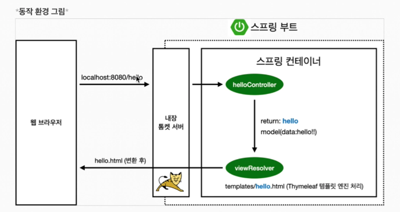

# 프로젝트 생성

사전준비물 

- Java 11 설치
- IntelliJ or Eclipse 설치


## 스프링 부트 스타터 사이트로 이동해서 스프링 프로젝트 생성

>  https://start.spring.io 

- Project 
  - 필요한 라이브러리 땡겨서 오고 관리하는 툴 
  - 요즘 추세는 Gradle Project
- Language
  - Java
- Spring Boot
  - snapshot은 만들고 있는 버전
- Project Meta
  - Group 
    - 보통 기업명
  - Artifact
    - 프로젝트명 

- Dependencies
  - Spring Web
    - 웹
  - Thymeleaf
    - 템플릿 엔진 

generate 하면 기본뼈대가 나옴


intellij open에서 다운받은 파일중 `build.gradle  ` 오픈 

오픈하면 Gradle 다운받음. 


## 라이브러리 살펴보기

> Gradle은 의존 관계가 있는 라이브러리를 함께 다운로드 한다.

### 스프링 부트 라이브러리 

- spring-boot starter-web
  - spring-boot-starter-tomcat:톰캣(웹서버)
  - spring-webmvc: 스프링 웹 MVC
- spring-boot-starter-thymeleaf: 타임리프 템플릿 엔진(view)
- spring-boot-stater(공통) : 스프링 부트 + 스프링 코어 + 로깅
  - spring-boot
    - spring-core
  - spring-boot-stater-logging
    - logback, slf4j

### 테스트 라이브러리

- spring-boot-stater-test
  - junit: 테스트 프레임워크
  - mockito: 목 라이브러리
  - assertj: 테스트 코드를 좀 더 편하게 작성하게 도와주는 라이브러리
  - spring-test: 스프링 통합 테스트 지원 


## View 환경 설정 


### welcome page 만들기

- resources/static/index.html을 올려두면 welcome page 기능을 제공함 

```html
<!DOCTYPE html>
<html lang="">
<head>
    <meta http-equiv="Content-Type" content="text/html; charset=utf-8" />
    <title>hello</title>
</head>
<body>
hello
<a href="/hello"> hello </a>
</body>
</html>

```

- thymeleaf 템플릿 엔진 
  - 장고 MTV 패턴의 T느낌 
  - [thymeleaf 공식 사이트](https://www.thymeleaf.org/)


### Controller

> 웹 어플리케이션에서의 첫번째 진입점 

- src/main/java/hello.hellospring/`controller` 패키지 생성

- `helloController` class 생성

- ```java
  package hello.hellospring.controller;
  
  import org.springframework.stereotype.Controller;
  import org.springframework.ui.Model;
  import org.springframework.web.bind.annotation.GetMapping;
  
  @Controller //controller 필수
  public class HelloController {
  
      @GetMapping("hello")  // get method hello url
      public String hello(Model model) {
          model.addAttribute("data","hello!!");
          return "hello";
      }
  }
  
  ```

- 


## Templates

```html
<!-- src/main/resources/templates/hello.html -->
<!DOCTYPE html>
<html xmlns:th="http://www.thymeleaf.org">
<head>
    <meta http-equiv="Content-Type" content="text/html; charset=utf-8" />
    <title>hello</title>
</head>
<body>
<p th:text="'안녕하세요. '+ ${data}" >안녕하세요. 손님 </p>
</body>
</html>
```


## 설명 

- GetMapping : http get url의 hello 로 매칭이 되면 helloController 클래스 실행

- return: `hello `

  - resources/templates/`hello`.html을 찾아서 랜더링 해라 
    - 컨트롤러에서 리턴 값으로 문자를 반환하면 뷰 리졸버(viewResolver)가 화면을 찾아서 처리
    - 스프링 부트 템플릿엔진 기본 viewName 매핑
    - resources:templates/ +{ViewName} + .html

  

- model(data:hello!!)

  - 모델에서 key값 props 느낌




자동으로 새로고침 하는법 

- `spring boot devtools `

- Gradle에 의존성 추가

- ```
  // build.gradle
  
  dependencies {
  	developmentOnly("org.springframework.boot:spring-boot-devtools")
  }
  ```

-  cmd +shift+ A >  Registry ... 

  - `compiler.automake.allow.when.app.running`  체크

- Preference 의 Build, Execution, Deployment -> Compiler

  - `Build project automatically`  체크

- main으로 실행

## 빌드하고 실행하기

```bash
$ls
>... gradlew 
```

mac 버전 gradlew 있는지 확인 

```bash
$ ./gradlew build
```

build 폴더 생성됨 

```bash
$ cd build
$ cd libs
$ ls
hello-spring-0.0.1-SNAPSHOT.jar
```

자바 실행하기 

```bash
$ java -jar hello-spring-0.0.1-SNAPSHOT.jar
```

