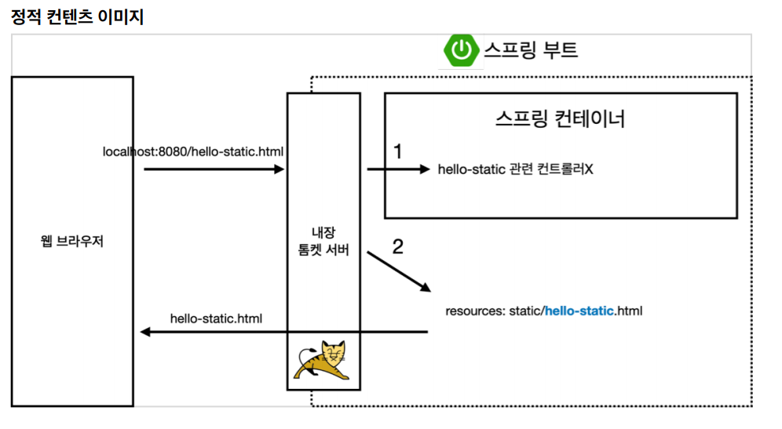
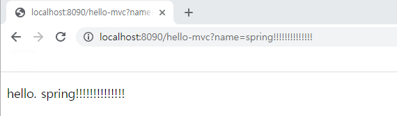
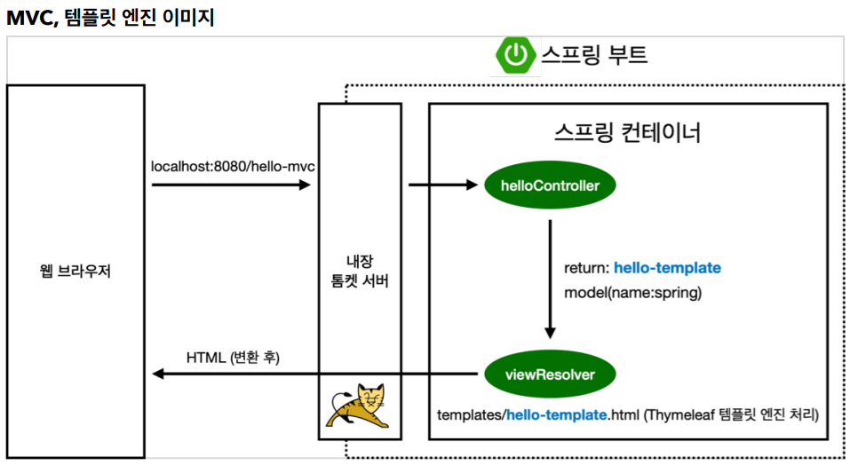

## 스프링 웹 개발 기초

### 정적 컨텐츠

* 그냥 파일을 웹브라우저에 띄워주는것!

* 그냥 static폴더안에 html파일을 넣으면 바로 반영됨

* 스프링 부트 정적 컨텐츠 기능 제공
* 변환기능 같은 거 없음!




### MVC와 템플릿 엔진

* MVC : Model, View, Controller

* View : 화면에 관련된 곳
* Model, Controller : 비즈니스 로직에만 신경쓰도록

**[Controller]**

```java
@Controller
public class HelloController {
	 @GetMapping("hello-mvc")
    public String helloMve(@RequestParam("name") String name, Model model) {
        model.addAttribute("name", name);
        return "hello-template";
    }
}
```

**[View]**

```html
<!doctype html>
<html lang="en" xmlns:th="http://www.thymeleaf.org">
<body>
<p th:text="'hello. '+ ${name}" >hello! empty</p>
</body>
</html>
```

- 데이터를 넘겨주면 변환해서 html파일로 띄워줌!






### API

**@ResponseBody 객체 반환**

- 객체를 반환할때, Json형식으로 반환한다.

**[Controller]**

> 단순 문자 반환

```java
@Controller
public class HelloController {
//    텍스트를 그대로 띄워줌
    @GetMapping("hello-string")
    @ResponseBody
    public String helloString(@RequestParam("name") String name) {
        return "hello " + name;  //"hello spring"
    }
}
```

* `@ResponseBody`를 사용하면 뷰 리졸버(`viewResolver`)를 사용하지 않음
* 대신 HTTP의 BODY에 문자 내용을 직접 반환(HTML BODY TAG가 아니라 문자 그대로 반환)

[실행] `http://localhost:8090/hello-string?name=spring!!!!`


**[Controller]**

```java
@Controller
public class HelloController {
//   객체가 오면 뷰리졸버대신 HttpMessageConverter가 받고
//   json 형식으로 바꿔서 보내줌
    @GetMapping("hello-api")
    @ResponseBody
    public Hello helloApi(@RequestParam("name") String name) {
        Hello hello = new Hello();
        hello.setName(name);
        return hello;
    }

    static class Hello {
        private String name;

        public String getName() {
            return name;
        }

        public void setName(String name) {
            this.name = name;
        }
    }
}
```

* `@ResponseBody`를 사용하고, 객체를 반환하면 객체가 JSON으로 변환됨

[실행]`http://localhost:8090/hello-api?name=spring!!!!`


* `@ResponseBody`를 사용
  * HTTP의 BODY에 문자 내용을 직접 반환
  * `viewResolver`대신에 `HttpMessageConverter`가 동작
  * 기본 문자처리 : `StringHttpMessageConverter`
  * 기본 객체처리 : `MappingJackson2HttpMessageConverter`

[참고]

- 클라이언트의 HTTP Accept 해더와 서버의 컨트롤러 반환 타입 정보 둘을 조합해서 `HttpMessageConverter`가 선택된다. 