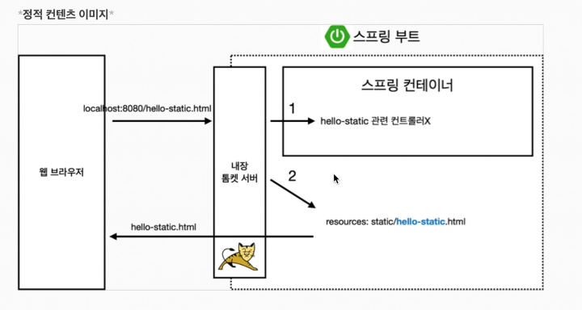
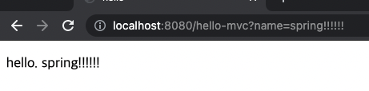
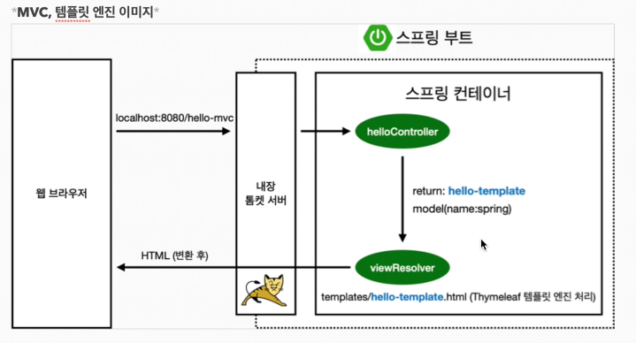
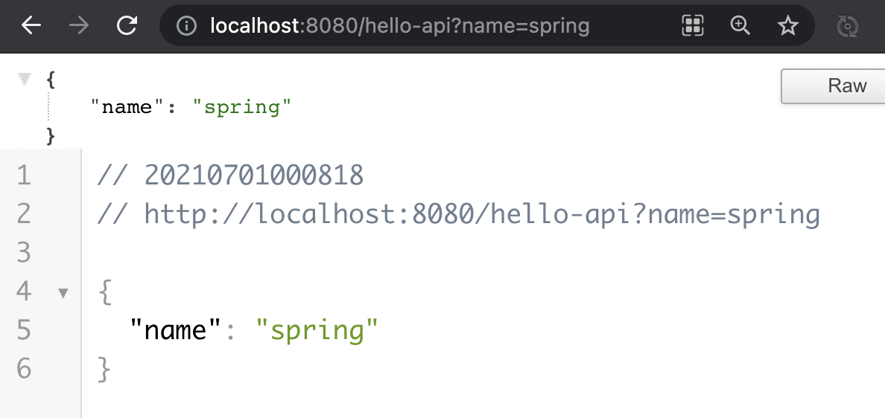
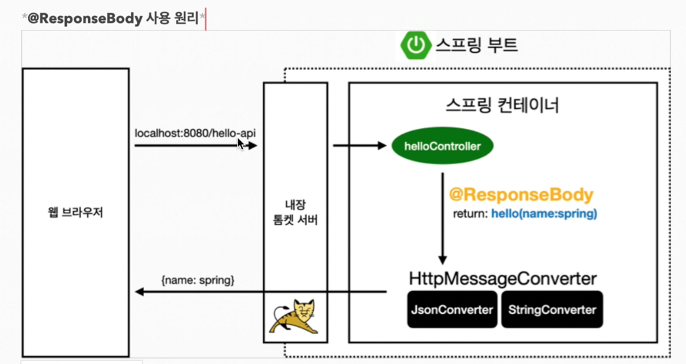

# 스프링 웹 개발 기초

- 정적 컨텐츠
- MVC와 템플릿 엔진 
- API


## 정적 컨텐츠 

- 스프링 부트 정적 컨텐츠 자동 제공  

resource/static/안에 있는 html 파일 그대로 랜더링 해줌 

```html
<!--resources/static/hello-static.html-->
<!DOCTYPE html>
<html lang="en">
<head>
    <meta charset="UTF-8">
    <title>Title</title>
</head>
<body>
정적 컨텐츠 입니다.
</body>
</html>
```


1. 내장 톰켓 서버 
2. 컨트롤러 쪽에서 hello-static 있는지 찾아봄 > 없음
3. 그다음 resource:static/hello-static.html 이 있는지 찾아봄 > 있네? 랜더링 반환 




## MVC와 템플릿 엔진

MVC: Model, View, Controller 

**controller**

```java
@GetMapping("hello-mvc")
    public String helloMvc(@RequestParam(value= "name") String name, Model model){
        model.addAttribute("name",name);
        return "hello-template";
    }
```

**View** 

```html
<!-- resources/templates/hello-template-->

<!DOCTYPE html>
<html xmlns:th="http://www.thymeleaf.org">
<head>
  <meta http-equiv="Content-Type" content="text/html; charset=utf-8" />
  <title>hello</title>
</head>
<body>
<p th:text="'hello. '+ ${name}" >hello! empty </p>
</body>
</html>
```




- Getmaping 
  - hello-mvc url로 들어오는거
- @requestParam value = name 
  - ㄹㅇ 파라미터 ?name= 
- addAttribute 
  - View에서 키 밸류 쌍으로 `${name}` 즉 컨트롤러에서 키가 name인 밸류를 집어넣음 
  - 이때 파람에서 받은 name을 addAttibute의 값으로 집어 넣었음 





## API

정적 컨텐츠를 제외하면 html or API 


**@ResponseBody 문자 반환**

```java
@GetMapping("hello-string")
@ResponseBody // response-body에 직접 넣어주겠다는 뜻
public String helloString(@RequestParam("name") String name){
    return "hello" + name; // "hello spring"
}
```

- @ResponseBody 를 사용하여 뷰 리볼저 (viewResolver) 를 사용하지 않음 
- 대신에 HTTP의 BODY에 문자 내용을 직접 반환


**ResponseBody 객체 반환**

```java
@GetMapping("hello-api")
@ResponseBody
public Hello helloApi(@RequestParam("name") String name) {
    Hello hello = new Hello();
    hello.setName(name);
    return hello;
}

static class Hello{
    private String name;

    public String getName() {
        return name;
    }

    public void setName(String name) {
        this.name = name;
    }
}
```

- getter & Setter 
  - cmd + N getter &setter 생성 가능 
  - private name으로 못꺼내니까 method로 여는 방법 
  - property 접근방식




- 

- hello-api > 톰캣 서버
- @ResponseBody 어노테이션이 붙어 있으면 그대로 응답을 넘기게 동작함 
- 객체로 반환을 하면 디폴트가 Json 방식으로 반환함 
- HttpMessageConverter 동작
  - 문자면 StringConverter 동작
  - 객체면 기본적으로 JsonConverter 동작함 
  - Json으로 바꿔서 보내줌 


