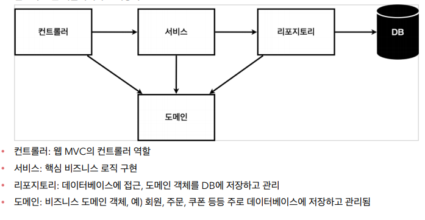
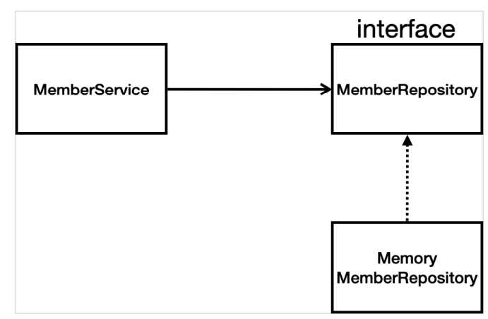
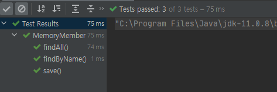

## 회원관리예제- 백엔드 개발

### 비즈니스 요구사항 정리

* 데이터 : 회원 ID, 이름
* 기능 : 회원 등록, 조회

**[일반적인 웹 애플리케이션 계층 구조]**



**[클래스 의존관계]**

- 아직 데이터 저장소를 선정하지 않아서, 인터페이스를 이용해 구현 클래스를 변경할 수 있도록 설계



### 회원 도메인과 리포지토리 만들기

**[회원 객체]**

```java
package hello.hellospring.domain;

public class Member {
    private Long id;
    private String name;

    public Long getId() {
        return id;
    }

    public void setId(Long id) {
        this.id = id;
    }

    public String getName() {
        return name;
    }

    public void setName(String name) {
        this.name = name;
    }
}

```

**[회원리포지토리 인터페이스]**

```java
package hello.hellospring.repository;

import hello.hellospring.domain.Member;

import java.util.List;
import java.util.Optional;

public interface MemberRepository {
    Member save(Member member);
    Optional<Member> findById(Long id);
    Optional<Member> findByName(String name);
    List<Member> findAll();


}
```

**[회원 리포지토리 메모리 구현체]**

```java
package hello.hellospring.repository;

import hello.hellospring.domain.Member;

import java.util.*;

public class MemoryMemberRepository implements MemberRepository{

    private static Map<Long, Member> store = new HashMap<>();
    private static long sequence = 0L;

    @Override
    public Member save(Member member) {
        member.setId(++sequence);
        store.put(member.getId(), member);
        return member;
    }

    @Override
    public Optional<Member> findById(Long id) {
//        null값일 때 처리해줌
        return Optional.ofNullable(store.get(id));
    }

    @Override
    public Optional<Member> findByName(String name) {
        return store.values().stream()
                .filter(member -> member.getName().equals(name))
                .findAny();
    }

    @Override
    public List<Member> findAll() {
        return new ArrayList<>(store.values());
    }
}

```

**[Java Optional]**

* 자바 8에서 최초로 도입

* Optional객체

> `Optional` 객체를 생성하기 위해서는 다양한 메서드들을 사용해야 함

  * `Optional.ofNullable`
    * value가 `null`인 경우 비어있는 `Optional`을 반환, 값이 `null`일 수도 있는 것에 해당 메소드를 사용

```java
// 메서드 시그니처
public static <T> Optional<T> ofNullable(T value);
// 예제
Optional<String> opt = Optional.ofNullable(null);
```

* Optional 중간 처리

> 옵셔널 객체를 생성한 후 사용 가능한 메서드
>
> 해당 메서드들은 다시 옵셔널을 반환해서 메서드 체이닝을 통해 원하는 로직을 반복 삽입 할 수 있음.

* `filter`
  * 값이 참이면 해당 필터를 통과시키고 거짓이면 통과 되지 않음
* `.stream()` 메서드는 중간처리 연산자로 기존 자바8에서 옵셔널 객체가 바로 스트림 객체로 전환 되지 않아 불편했던 부분을 해소시켜줌

> 그렇다고 모든 분기문에 Optional을 적용할 필요는 없음!! if문이 적절한 곳에는 if를 사용해서 코드 가독성을 높이는 것이 더 좋은 경우도 있음!

****


### 회원 리포지토리 테스트 케이스 작성

* 개발한 기능을 직접 다 찾아보면서 확인해보는 것은 오래 걸리고, 반복실행에 어려움이 있음
* JUnit이라는 프레임워크를 이용해 테스트를 실행

**[회원 리포지토리 메모리 구현체 테스트]**

`src/test/java` 하위 폴더에 생성

```java
package hello.hellospring.repository;

import hello.hellospring.domain.Member;
import org.assertj.core.api.Assertions;
import org.junit.jupiter.api.AfterEach;
import org.junit.jupiter.api.Test;

import java.util.List;
import java.util.Optional;

import static org.assertj.core.api.Assertions.*;


class MemoryMemberRepositoryTest {
    MemberRepository repository = new MemoryMemberRepository();

    //Test는 순서를 보장안해줌
    // 따라서 한 번 테스를 끝내면 그 때 마다 clear를 해주어야함!
    @AfterEach
    public void afterEach(){
        repository.clearStore();
    }
	/*
		추가코드
		public void clearStore() {
        	store.clear();
        }
    */
    @Test
    public void save(){
        Member member = new Member();
        member.setName("spring");

        repository.save(member);

        Member result = repository.findById(member.getId()).get();
        assertThat(member).isEqualTo(result);

    }

    @Test
    public void findByName(){
        Member member1 = new Member();
        member1.setName("spring1");
        repository.save(member1);

        Member member2 = new Member();
        member2.setName("spring2");
        repository.save(member2);

        Member result = repository.findByName("spring1").get();
        assertThat(result).isEqualTo(member1);
    }

    @Test
    public void findAll() {
        Member member1 = new Member();
        member1.setName("spring1");
        repository.save(member1);

        Member member2 = new Member();
        member2.setName("spring2");
        repository.save(member2);

        List<Member> result = repository.findAll();

        assertThat(result.size()).isEqualTo(2);

    }
}

```

* `@AfterEach`: 한번에 여러 테스트를 실행하면 메모리 DB에 직전 테스트의 결과가 남을 수 있음. 이렇게 되면 이전 테스트 때문에 다음 테스트가 실패할 가능성이 있다. `@AfterEach`를 사용하면 각 테스트가 종료될 때마다 이 기능을 실행한다. 여기서는 메모리 DB에 저장된 데이터를 삭제한다.
* 테스트는 각각 독립적으로 실행되어야 한다. 테스트 순서에 의존 관계가 있는 것은 좋은 테스트가 아니다



**[회원 서비스 개발]**

```java
package hello.hellospring.service;

import hello.hellospring.domain.Member;
import hello.hellospring.repository.MemberRepository;
import hello.hellospring.repository.MemoryMemberRepository;

import java.util.List;
import java.util.Optional;

public class MemberService {
    private final MemberRepository memberRepository = new MemoryMemberRepository();

    /**
     * 회원가입
     */
    public Long join(Member member){
        //같은 이름이 있는 중복 회원 X
        validateDuplicateMember(member);    //중복 회원 검증
        memberRepository.save(member);
        return member.getId();
    }

    private void validateDuplicateMember(Member member) {
        memberRepository.findByName(member.getName())
                .ifPresent(m -> {
                    throw new IllegalStateException("이미 존재하는 회원입니다.");
                });
    }

    /**
    전체 회원 조회
     **/
    public List<Member> findMembers(){
        return memberRepository.findAll();
    }
    public Optional<Member> findOne(Long memberId){
        return memberRepository.findById(memberId);
    }
}

```

**[회원 서비스 테스트]**

* 한국어로 테스트 가능
* 자동으로 생성 가능 (ctrl+T)

> 기존에는 회원 서비스가 메모리 회원 리포지토리를 직접 생성했음

```java
public class MemberService {
    private final MemberRepository memberRepository = 
        					new MemoryMemberRepository();
}
```

> 회원 리포지토리의 코드가 회원 서비스 코드를 DI가능하게 변경

```java
public class MemberService {
    private final MemberRepository memberRepository;

    public MemberService(MemberRepository memberRepository) {
        this.memberRepository = memberRepository;
    }
    ...
}
```

**회원 서비스 테스트 코드**

```java
package hello.hellospring.service;

import hello.hellospring.domain.Member;
import hello.hellospring.repository.MemoryMemberRepository;
import org.junit.jupiter.api.AfterEach;
import org.junit.jupiter.api.Assertions;
import org.junit.jupiter.api.BeforeEach;
import org.junit.jupiter.api.Test;

import java.util.Optional;

import static org.assertj.core.api.Assertions.assertThat;
import static org.junit.jupiter.api.Assertions.*;

class MemberServiceTest {

    MemberService memberService;
    MemoryMemberRepository memberRepository;

//   테스트 실행전에 동작 (외부에서 넣어주기 DI)
    @BeforeEach
    public void beforeEach() {
        memberRepository = new MemoryMemberRepository();
        memberService = new MemberService(memberRepository);
    }

    @AfterEach
    public void afterEach(){
        memberRepository.clearStore();
    }

    @Test
    void 회원가입() {
        //given
        Member member = new Member();
        member.setName("hello");

        //when
        //Extract Variable (ctrl+alt+v)
        Long saveId = memberService.join(member);

        //then
        Member findMember = memberService.findOne(saveId).get();
        assertThat(member.getName()).isEqualTo(findMember.getName());
    }

    @Test
    public void 중복_회원_예외() {
        //given
        Member member1 = new Member();
        member1.setName("spring");

        Member member2 = new Member();
        member2.setName("spring");

        //when
        memberService.join(member1);
        IllegalStateException e = assertThrows(IllegalStateException.class, () -> memberService.join(member2));
        assertThat(e.getMessage()).isEqualTo("이미 존재하는 회원입니다.");

//        try {
//            memberService.join(member2);
//            fail();
//        }catch (IllegalStateException e){
//            assertThat(e.getMessage()).isEqualTo("이미 존재하는 회원입니다.");
//        }
//
        //then
    }

    @Test
    void findMembers() {
    }

    @Test
    void findOne() {
    }
}
```

* `@BeforeEach`: 각 테스트 실행 전에 호출 됨. 테스트가 서로 영향이 없도록 항상 새로운 객체를 생성하고, 의존 관계도 새로 맺어줌!


