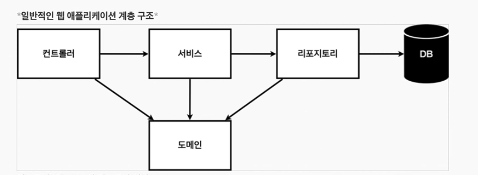
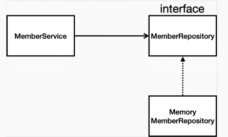
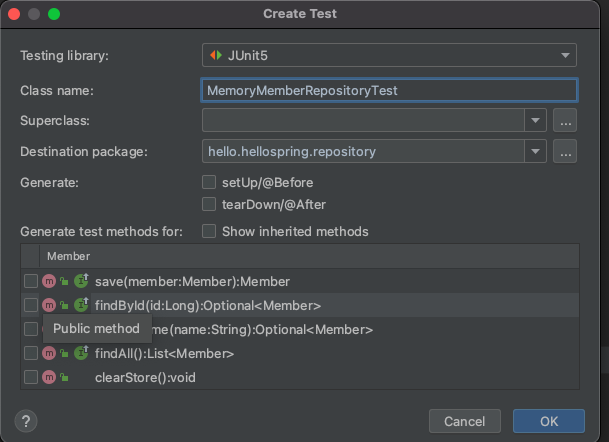

# 회원 관리 예제 - 백엔드 개발 

- 비즈니스 요구사항 정리
- 회원도메인과 레포 만들기
- 회원 레포 테스트 케이스 작성
- 회원 서비스 개발
- 회원 서비스 테스트


## 비즈니스 요구사항 정리

- 데이터
  - 회원 ID, 이름 
  - 간단한 비즈니스 모델로 스프링 시작해보자 
- 기능 
  - 회원등록, 조회
- 아직 DB가 선정되지 않은 상태로 개발 진행 시나리오 


**일반적인 웹 애플리케이션 계층 구조**



- 컨트롤러 : 웹 MVC 의 컨트롤러 역할
- 서비스: 핵심 비즈니스 로직 구현
- 리포지토리: 데이터베이스에 접근, 도메인 객체를 DB에 저장하고 관리
- 도메인 : 비즈니스 도메인 객체 예) 회원,주문,쿠폰 등등 주로 데이터베이스에 저장하고 관리됨 


**클래스 의존관계**




- 아직 데이터 저장소가 선정되지 않아서, 우선 인터페이스로 구현 클래스를 변경할 수 있도록 설계
- 데이터 저장소는 RDB, NoSQL 등등 다양한 저장소를 고민중인 상황으로 가정
- 개발을 진행하기 위해서 초기 개발 단계에서는 구현체로 가벼운 메모리 기반의 데이터 저장소 사용 


## 회원 도메인과 리포지토리 만들기 

**domain/Member** 

간단한 id와 name 그리고 getter&setter method를 만들어준다. 

```java
package hello.hellospring.domain;

public class Member {

    private Long id;
    private String name;

    public String getName() {
        return name;
    }

    public void setName(String name) {
        this.name = name;
    }

    public Long getId() {
        return id;
    }

    public void setId(Long id) {
        this.id = id;
    }
}

```

**repository/MemberRepositroy**

interface로 만들어서 붕어빵 틀을 만들어 놓는다. 

<>는 제너릭스로 명시된 규격만을 넣겠다는 약속

interface는 return을 안만듬. implements 받는 곳에서 각각의 붕어빵을 만드는 개념 


```java
package hello.hellospring.repository;

import hello.hellospring.domain.Member;

import java.util.List;
import java.util.Optional;

public interface MemberRepository {
    Member save(Member member);
    Optional<Member> findById(Long id);
    Optional<Member> findByName(String name);
    List<Member> findAll();
}
```

**repository/MemoryMemberRepositroy**

MODEL 부분 

MemberRepository의 붕어빵으로 만드는 MemoryMemberRepositroy


HashMap<> : key-value쌍으로 만드는 딕셔너리 같은거 DB 찾을때 빠르게 찾을 수 있음 

sequence : id값 하나씩 올려줄 용도의 변수 


store.put(member.getId(), member);  store에다가 id: member 쌍으로 저장 

store.get(id)); store에 저장되어있는 id key 로 value 가져오기

 findByName(String name)  :  store안의 value값중에서 필터 > DB 안에 이름이랑 인풋값이랑 같은거중 첫번째꺼 있는지 

findAll() : 값 다 들고오는 메소드 

clearStore: 테스트시 store clear 용도로 사용 

```java
package hello.hellospring.repository;

import hello.hellospring.domain.Member;

import java.util.*;

public class MemoryMemberRepository implements MemberRepository{

    private static Map<Long, Member> store = new HashMap<>();
    private static long sequence = 0L;

    @Override
    public Member save(Member member) {
        member.setId(++sequence);
        store.put(member.getId(), member);
        return member;
    }

    @Override
    public Optional<Member> findById(Long id) {
        return Optional.ofNullable(store.get(id));
    }

    @Override
    public Optional<Member> findByName(String name) {
        return store.values().stream()
                .filter(member -> member.getName().equals(name))
                .findAny();
    }

    @Override
    public List<Member> findAll() {
        return new ArrayList<>(store.values());
    }

    public void clearStore(){
        store.clear();
    }
}
```

**service/MemberService**

service 부분이 장고의 VIEW 부분이라고 보면 됨 

회원가입시 memberRepository.save(member); 

validateDuplicateMember: 

```java
public class MemberService {

    private final MemberRepository memberRepository;

    public MemberService(MemberRepository memberRepository) {
        this.memberRepository = memberRepository;
    }

    /* 회원가입 */
    public Long join(Member member){
        validateDuplicateMember(member); // 같은 이름이 있는 중복 회원은 안된다.
        memberRepository.save(member);
        return member.getId();

    }

    private void validateDuplicateMember(Member member) {
        memberRepository.findByName(member.getName())
            .ifPresent(m ->  {
                throw new IllegalStateException("이미 존재하는 회원입니다");
        });
    }

    /* 전체 회원 조회 */
    public List<Member> findMembers(){
        return memberRepository.findAll();
    }

    public  Optional<Member> findOne(Long memberId){
        return memberRepository.findById(memberId);
    }
}
```


## 회원 리포지토리 테스트 케이스 작성

개발한 기능을 실행해서 테스트 할때 자바의 main 메서드를 통해서 실행하거나, 웹 애플리케이션의 컨트롤러를 통해서 해당 기능을 실행한다. 이러한 방법은 준비하고 실행하는데 오래 걸리고, 반복 실행하기 어렵고 여러 테스트를 한번에 실행하기 어렵다는 단점이 있다. 자바는 JUnit이라는 프레임워크로 테스트를 실행해서 해결한다 .

 

cmd + N 에서 TEST 누르면 쉽게 뼈대를 만들 수 있다 .



**test/service/MemberServiceTest**

Junit으로 쉽게 테스트 진행가능 

@Test 어노테이션으로 각각 테스트중 

@afterEach로 하나의 테스트진행후에 store 클리어링 해주면서 다음 테스트에서 오류없이 가능 

@beforeEach 테스트전에 똑같은 DB와 Service 객체를 사용하기 위해 하나로 묶어주는 작업함 

테스트할때 이름같은경우는 보통 빌드할떄 안올라가기떄문에 한글로 적어도 문제없다.


```java
class MemberServiceTest {

    MemberService memberService;
    MemoryMemberRepository memberRepository;

    @BeforeEach
    public void beforeEach(){
        memberRepository = new MemoryMemberRepository();
        memberService = new MemberService(memberRepository)
    }
    @AfterEach
    public void afterEach(){
        memberRepository.clearStore();
    }
    @Test
    void 회원가입() {
        // given
        Member member = new Member();
        member.setName("hello");

        // when
        Long saveId = memberService.join(member);


        // then
        Member findMember = memberService.findOne(saveId).get();
        assertThat(member.getName()).isEqualTo(findMember.getName());

    }

    @Test
    public void 중복_회원_예외(){
        //given
        Member member1 = new Member();
        member1.setName("spring");

        Member member2 = new Member();
        member2.setName("spring");

        //when
        memberService.join(member1);
        IllegalStateException e = assertThrows(IllegalStateException.class, () -> memberService.join(member2));

        assertThat(e.getMessage()).isEqualTo("이미 존재하는 회원입니다");

//        try {
//            memberService.join(member1);
//            fail();
//        }catch (IllegalStateException e ){
//            assertThat(e.getMessage()).isEqualTo("이미 존재하는 회원입니다.");
//        }
        //then
    }
    @Test
    void findMembers() {

    }

    @Test
    void findOne() {
    }
}
```
