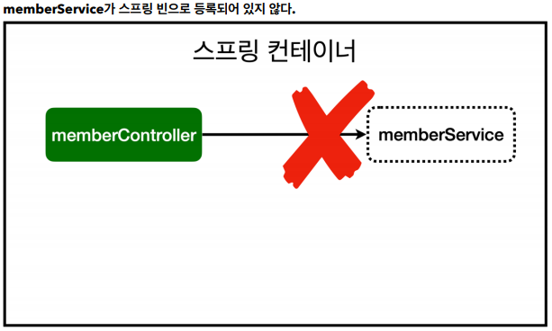
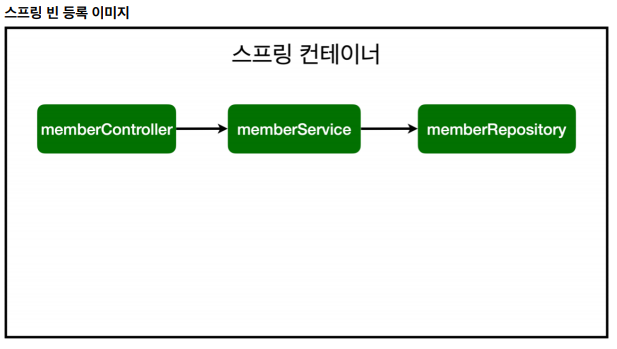

## 스프링 빈과 의존관계

### 스프링 빈을 등록하는 2가지 방법

* 컴포넌트 스캔과 자동 의존관계 설정
* 자바 코드로 직접 스프링 빈 등록하기

### 컴포넌트 스캔과 자동 의존관계 설정

* 회원 컨트롤러가 회원서비스와 회원 리포지토리를 사용할 수 있도록 의존관계 설정

* @Controller , @Service .. 안에는 @Component가 들어가져 있음!

* 스프링이 등록될 때, 관련된 annotation을 객체로 등록해줌

* @Autowired는 연결을 담당함

* 대상은 같은 패키지내의 하위컴포넌트만 스캔함

**[회원 컨트롤러에 의존관계 추가]**

```java
package hello.hellospring.controller;

import hello.hellospring.service.MemberService;
import org.springframework.beans.factory.annotation.Autowired;
import org.springframework.stereotype.Controller;

@Controller
public class MemberController {

//    private final MemberService memberService = new MemberService();
//    에러 발생 : 다른 컨트롤러도 MemberService를 사용할 수 있기 때문에
//    같이 공유해서 사용하면 됨 ! 굳이 여러개의 생성을 할 필요가 없음!
    private final MemberService memberService;

    //생성자와 연결
    //Spring이 @Autowired를 찾아서 자동으로 연결시켜줌
    //이를 위해서는 Service에도 @Service를 등록해 주어야 함!
    //Repository에도 @Repository등록

    //MemberController가 생성이 될 때, Spring 빈에 등록되어 있는
    //MemberService의 객체를 넣어줌 -> DI
    @Autowired
    public MemberController(MemberService memberService) {
        this.memberService = memberService;
    }
    //Controller를 통해 외부요청을 받고 Service에서 비즈니스 로직을 만들고
    //Repository에서 데이터를 저장한다!
}

```

* 생성자에 `@Autowired`가 있으면 스프링이 연관된 객체를 스프링 컨테이너에서 찾아서 넣어준다. 이렇게 객체 의존관계를 외부에서 넣어주는 것을 DI(Dependency Injection), 의존성 주입이라 한다.
* 이전 테스트에서는 개발자가 직접 주입했고, 여기서는 @Autowired에 의해 스프링이 주입해준다.



* helloController는 스프링이 제공하는 컨트롤러여서 스프링 빈으로 자동 드록
* `@Controller`가 있으면 자동 등록 된다.

**[컴포넌트 스캔 원리]**

* `@Component`애노테이션이 있으면 스프링 빈으로 자동 등록된다.
* `@Controller`컨트롤러가 스프링 빈으로 자동 등록된 이유도 컴포넌트 스캔 때문이다.
* `@Component`를 포함하는 다음 애노테이션도 스프링 빈으로 자동 등록된다.
  * `@Controller`
  * `@Service`
  * `@Repository`

**[회원 서비스 스프링 빈 등록]**

```java
@Service
public class MemberService {
    private final MemberRepository memberRepository;

    //
    @Autowired
    public MemberService(MemberRepository memberRepository) {
        this.memberRepository = memberRepository;
    }
}
```

* 생성자에 `@Autowired`를 사용하면 객체 생성 시점에 스프링 컨테이너에서 해당 스프링 빈을 찾아서 주입한다.
* 생성자가 1개만 있으면 `@Autowired`는 생략할 수 있다.

**[회원 리포지토리 스프링 빈 등록]**

```java
@Repository
public class MemoryMemberRepository implements MemberRepository{}
```




* `memberService`와 `memberRepository`가 스프링 컨테이너에 스프링 빈으로 등록되었다.
* 스프링은 스프링 컨테이너에 스프링 빈을 등록할 때, 기본으로 싱글통으로 등록한다(유일하게 하나만 등록해서 공유함) 따라서 같은 스프링 빈이면 모두 같은 인스턴스이다.
* 설저으로 싱글통니 아니게 설정할 수 있지만, 특별한 경우를 제외하면 대부분 싱글톤을 사용한다.


### 자바 코드로 직접 스프링 빈 등록하기

* 회원서비스와 회원 리포지토리의 @Service, @Repository, @Autowired 애노테이션 제거 후 진행
* @Controller는 남겨둠!

```java
package hello.hellospring.service;

import hello.hellospring.repository.MemberRepository;
import hello.hellospring.repository.MemoryMemberRepository;
import org.springframework.context.annotation.Bean;
import org.springframework.context.annotation.Configuration;

@Configuration
public class SpringConfig {

    @Bean
    public MemberService memberService(){
        return new MemberService(memberRepository());
    }

    @Bean
    public MemberRepository memberRepository() {
        return new MemoryMemberRepository();
    }
}

```

* 이렇게 만들어두면 향후 리포지토리를 다른 리포지토리로 변경할 때, 이 곳에서만 수정해주면 된다.
* DI에는 필드 주입, setter주입, 생성자 주입 이렇게 3가지 방법이 있다. 의존 관계가 실행 중에 동적으로 변하는 경우는 거의 없으므로 생성자 주입을 권장한다.
* 실무에서는 주로 정형화된 컨트롤러, 서비스, 리포지토리 같은 코드는 컴포넌트 스캔을 사용한다. 그리고 정형화되지 않거나, 상황에 따라 구현 클래스를 변경해야 하면 설정을 통해 스프링 빈으로 등록한다.
* `@Autowired` 를 통한 DI는 `helloController`, `memberService`등과 같이 스프링이 관리하는 객체에서만 동작한다. 스프링 빈으로 등록하지 않고 내가 직접 생성한 객체에서는 동작하지 않는다.

