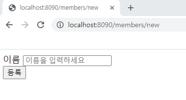

## 회원관리예제 - 웹MVC 개발

### 화면 웹 기능 - 홈 화면 추가

**[홈 컨트롤러 추가]**

```java
package hello.hellospring.controller;

import org.springframework.stereotype.Controller;
import org.springframework.web.bind.annotation.GetMapping;

@Controller
public class HomeController {

    @GetMapping("/")
    public String home(){
        return "home";
    }
}
```

**[회원 관리용 홈]**

```html
<!DOCTYPE HTML>
<html xmlns:th="http://www.thymeleaf.org">
<body>
<div class="container">
    <div>
        <h1>Hello Spring</h1>
        <p>회원 기능</p>
        <p>
            <a href="/members/new">회원 가입</a>
            <a href="/members">회원 목록</a>
        </p>
    </div>
</div> <!-- /container -->
</body>
</html>
```

* 컨트롤러가 정적 파일보다 우선순위가 높아서, static말고 컨트롤러가 존재하면 이걸로 띄워줌


### 회원등록 컨트롤러

**[웹 등록 화면에서 데이터를 전달 받을 폼 객체]**

```java
package hello.hellospring.controller;

public class MemberForm {
    private String name;

    public String getName() {
        return name;
    }

    public void setName(String name) {
        this.name = name;
    }
}

```

**[회원 컨트롤러에서 회원을 실제 등록하는 기능]**

```java
  @PostMapping("/members/new")
    public String create(MemberForm form){
        Member member = new Member();
        member.setName(form.getName());

        memberService.join(member);

        return "redirect:/";
    }
```



### 회원 웹 기능 - 조회

* IntelliJ 단축키 : `ctrl `+ `e` = 이전 파일로 돌아가기

**[회원 컨트롤러에서 조회 기능]**

```java
@GetMapping("/members")
    public String list(Model model){
        List<Member> members = memberService.findMembers();
        model.addAttribute("members", members);
        return "members/memberList";
    }
```

**[회원 리스트 HTML]**

```html
<!DOCTYPE HTML>
<html xmlns:th="http://www.thymeleaf.org">
<body>
<div class="container">
    <div>
        <table>
            <thead>
            <tr>
                <th>#</th>
                <th>이름</th>
            </tr>
            </thead>
            <tbody>
            <tr th:each="member : ${members}">
                <td th:text="${member.id}"></td>
                <td th:text="${member.name}"></td>
            </tr>
            </tbody>
        </table>
    </div>
</div> <!-- /container -->
</body>
</html>
```


