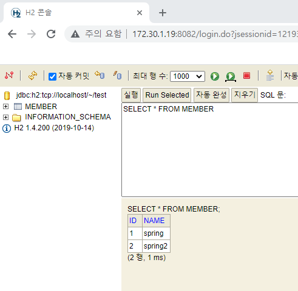
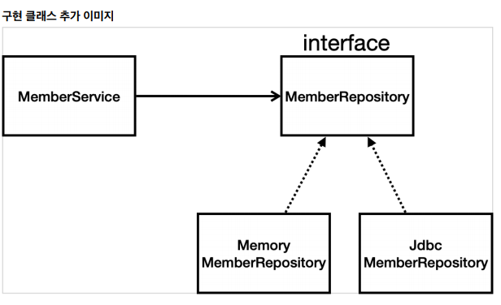
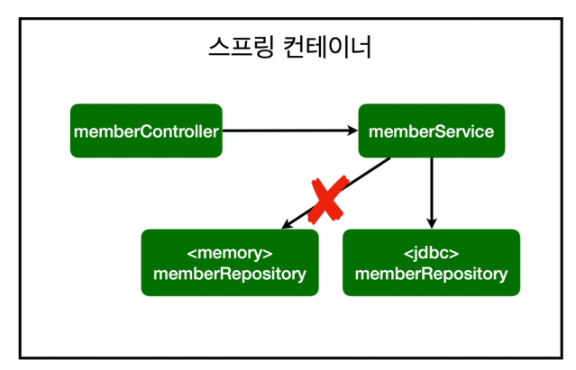
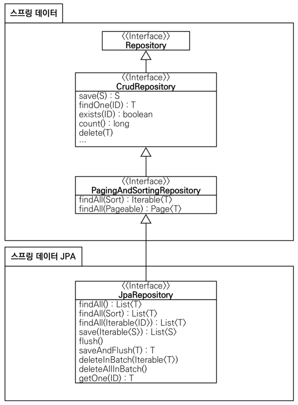

## 스프링 DB접근 기술

* 순수 JDBC > Jdbc Template > JPA > 스프링 데이터 JPA

### H2 데이터베이스 설치

* 개발이나 테스트 용도로 가볍고 편리한 DB, 웹 화면 제공

**[테이블 생성]**

```sql
drop table if exists member CASCADE;
create table member(
 id bigint generated by default as identity,
 name varchar(255),
 primary key (id)
);
```




### Jdbc 리포지토리 구현

* 직접 다 구현하는 방식, 요즘에는 이런 방식을 잘 쓰지 않는다!
* 코드가 길고 복잡하며, 중복이 많이 발생

**[Jdbc 회원 리포지토리]**

```java
package hello.hellospring.repository;

import hello.hellospring.domain.Member;
import org.springframework.jdbc.datasource.DataSourceUtils;

import javax.sql.DataSource;
import java.sql.*;
import java.util.ArrayList;
import java.util.List;
import java.util.Optional;

public class JdbcMemberRepository implements MemberRepository{

    private final DataSource dataSource;

    public JdbcMemberRepository(DataSource dataSource) {
        this.dataSource = dataSource;
    }

    @Override
    public Member save(Member member) {
        String sql = "insert into member(name) values(?)";
        Connection conn = null;
        PreparedStatement pstmt = null;
        ResultSet rs = null;
        try {
            conn = getConnection();
            pstmt = conn.prepareStatement(sql, Statement.RETURN_GENERATED_KEYS);
            pstmt.setString(1, member.getName());

            pstmt.executeUpdate();
            rs = pstmt.getGeneratedKeys();

            if (rs.next()) {
                member.setId(rs.getLong(1));
            } else {
                throw new SQLException("id 조회 실패");
            }
            return member;
        } catch (Exception e) {
            throw new IllegalStateException(e);
        } finally {
            close(conn, pstmt, rs);
        }
    }
    @Override
    public Optional<Member> findById(Long id) {
        String sql = "select * from member where id = ?";

        Connection conn = null;
        PreparedStatement pstmt = null;
        ResultSet rs = null;
        try {
            conn = getConnection();
            pstmt = conn.prepareStatement(sql);
            pstmt.setLong(1, id);

            rs = pstmt.executeQuery();

            if(rs.next()) {
                Member member = new Member();
                member.setId(rs.getLong("id"));
                member.setName(rs.getString("name"));
                return Optional.of(member);
            } else {
                return Optional.empty();
            }
        } catch (Exception e) {
            throw new IllegalStateException(e);
        } finally {
            close(conn, pstmt, rs);
        }
    }
    @Override
    public List<Member> findAll() {
        String sql = "select * from member"; Connection conn = null;

        PreparedStatement pstmt = null;
        ResultSet rs = null;
        try {
            conn = getConnection();
            pstmt = conn.prepareStatement(sql);

            rs = pstmt.executeQuery();

            List<Member> members = new ArrayList<>();
            while(rs.next()) {
                Member member = new Member();
                member.setId(rs.getLong("id"));
                member.setName(rs.getString("name"));
                members.add(member);
            }
            return members;
        } catch (Exception e) {
            throw new IllegalStateException(e);
        } finally {
            close(conn, pstmt, rs);
        }
    }
    @Override
    public Optional<Member> findByName(String name) {
        String sql = "select * from member where name = ?";
        Connection conn = null;
        PreparedStatement pstmt = null;
        ResultSet rs = null;
        try {
            conn = getConnection();
            pstmt = conn.prepareStatement(sql);
            pstmt.setString(1, name); rs = pstmt.executeQuery();
            if(rs.next()) {
                Member member = new Member();
                member.setId(rs.getLong("id"));
                member.setName(rs.getString("name"));
                return Optional.of(member);
            }
            return Optional.empty();
        } catch (Exception e) {
            throw new IllegalStateException(e);
        } finally {
            close(conn, pstmt, rs);
        }
    }
    private Connection getConnection() {
        return DataSourceUtils.getConnection(dataSource);
    }
    private void close(Connection conn, PreparedStatement pstmt, ResultSet rs)
    {
        try {
            if (rs != null) {
                rs.close();
            }
        } catch (SQLException e) {
            e.printStackTrace();
        }
        try {
            if (pstmt != null) {
                pstmt.close();
            }
        } catch (SQLException e) {
            e.printStackTrace();
        }
        try {
            if (conn != null) { close(conn);
            }
        } catch (SQLException e) {
            e.printStackTrace();
        }
    }
    private void close(Connection conn) throws SQLException {
        DataSourceUtils.releaseConnection(conn, dataSource);
    }
}
```

**[스프링 설정 변경 _ config파일]**

```java
package hello.hellospring.service;

import hello.hellospring.repository.JdbcMemberRepository;
import hello.hellospring.repository.MemberRepository;
import hello.hellospring.repository.MemoryMemberRepository;
import org.springframework.beans.factory.annotation.Autowired;
import org.springframework.context.annotation.Bean;
import org.springframework.context.annotation.Configuration;

import javax.sql.DataSource;

@Configuration
public class SpringConfig {

    private DataSource dataSource;

    @Autowired
    public SpringConfig(DataSource dataSource){
        this.dataSource = dataSource;
    }

    @Bean
    public MemberService memberService(){
        return new MemberService(memberRepository());
    }

    @Bean
    public MemberRepository memberRepository() {
//        return new MemoryMemberRepository();
        return new JdbcMemberRepository(dataSource);
    }
}
```

* DataSource는 데이터베이스 커넥션을 획득할 때 사용하는 객체
* 스프링부트는 데이터베이스 커넥션 정보를 바탕으로 DataSource를 생성하고 스프링 빈으로 만들어둔다
* 그래서 DI를 받을 수 있다.

**[구현 클래스 이미지]**

> interface로부터 확장



**[스프링 설정 이미지]**



* 개방-폐쇄 원칙(OCP, Open-Close Pinciple)
  * 객체지향의 특징
  * 확장에는 열려있고, 수정(변경)에는 닫혀있다.
* 스프링의 DI(Dependencies Injection)을 사용하면 **기존 코드를 전혀 손대지 않고, 설정만으로 구현클래스를 변경할 수 있다!**
* 이제 DB를 연결했으니깐 회원 등록과 조회가 연속적으로 가능하다.


**[스프링 통합 테스트]**

* 스프링 컨테이너와 DB까지 연결한 통합테스트


**[회원 서비스 스프링 통합 테스트]**

```java
package hello.hellospring.service;

import hello.hellospring.domain.Member;
import hello.hellospring.repository.MemberRepository;
import hello.hellospring.repository.MemoryMemberRepository;
import org.junit.jupiter.api.AfterEach;
import org.junit.jupiter.api.BeforeEach;
import org.junit.jupiter.api.Test;
import org.springframework.beans.factory.annotation.Autowired;
import org.springframework.boot.test.context.SpringBootTest;
import org.springframework.transaction.annotation.Transactional;

import static org.assertj.core.api.Assertions.assertThat;
import static org.junit.jupiter.api.Assertions.assertThrows;

@SpringBootTest
// Test실행시 트랜잭션 실행 후 테스트가 끝나면 롤백처리를 해줌
@Transactional
class MemberServiceIntegrationTest {

//    필드 기반 Autowired
    @Autowired MemberService memberService;
    @Autowired MemberRepository memberRepository;

    @Test
    void 회원가입() {
        //given
        Member member = new Member();
        member.setName("spring");

        //when
        //Extract Variable (ctrl+alt+v)
        Long saveId = memberService.join(member);

        //then
        Member findMember = memberService.findOne(saveId).get();
        assertThat(member.getName()).isEqualTo(findMember.getName());
    }

    @Test
    public void 중복_회원_예외() {
        //given
        Member member1 = new Member();
        member1.setName("spring");

        Member member2 = new Member();
        member2.setName("spring");

        //when
        memberService.join(member1);
        IllegalStateException e = assertThrows(IllegalStateException.class, () -> memberService.join(member2));
        assertThat(e.getMessage()).isEqualTo("이미 존재하는 회원입니다.");

    }

}
```

* `@SpringBootTest`: 스프링 컨테이너와 테스트를 함께 실행한다.
* `@Transactional`: 테스트 케이스에 이 애노테이션이 있으면, 테스트 시작 전에 트랜잭션을 시작하고, 테스트 완료 후에 항상 롤백한다. 이렇게 하면 DB에 데이터가 남지 않으므로 다음 테스트에 영향을 주지 않는다.

### 스프링 JdbcTemplate

* 순수 Jdbc와 동일한 환경설정을 하면 된다.
* 스프링 JdbcTemplate과 MyBatis 같은 라이브러리는 JDBC API에서 본 반복 코드를 대부분 제거해준다. 하지만 SQL은 직접 작성해야한다.

**[스프링 JdbcTempalte 회원 리포지토리]**

```java
package hello.hellospring.repository;

import hello.hellospring.domain.Member;
import org.springframework.beans.factory.annotation.Autowired;
import org.springframework.jdbc.core.JdbcTemplate;
import org.springframework.jdbc.core.RowMapper;
import org.springframework.jdbc.core.namedparam.MapSqlParameterSource;
import org.springframework.jdbc.core.simple.SimpleJdbcInsert;

import javax.sql.DataSource;
import java.sql.ResultSet;
import java.sql.SQLException;
import java.util.HashMap;
import java.util.List;
import java.util.Map;
import java.util.Optional;

public class JdbcTemplateMemberRepository implements MemberRepository {

    private final JdbcTemplate jdbcTemplate;

//    생성자가 1개면 @Autowired 생략가능
    public JdbcTemplateMemberRepository(DataSource dataSource) {
        jdbcTemplate = new JdbcTemplate(dataSource);
    }

    @Override
    public Member save(Member member) {
        SimpleJdbcInsert jdbcInsert = new SimpleJdbcInsert(jdbcTemplate);
        jdbcInsert.withTableName("member").usingGeneratedKeyColumns("id");
        Map<String, Object> parameters = new HashMap<>();
        parameters.put("name", member.getName());
        Number key = jdbcInsert.executeAndReturnKey(new MapSqlParameterSource(parameters));
        member.setId(key.longValue());
        return member;
    }

    @Override
    public Optional<Member> findById(Long id) {
        List<Member> result = jdbcTemplate.query("select * from member where id=?", memberRowMapper(), id);
        return result.stream().findAny();
    }

    @Override
    public Optional<Member> findByName(String name) {
        List<Member> result = jdbcTemplate.query("select * from member where name = ?", memberRowMapper(), name);
        return result.stream().findAny();
    }

    @Override
    public List<Member> findAll() {
        return jdbcTemplate.query("select * from member", memberRowMapper());
    }

    private RowMapper<Member> memberRowMapper(){
        return (rs, rowNum) -> {
            Member member = new Member();
            member.setId(rs.getLong("id"));
            member.setName(rs.getString("name"));
            return member;
        };
    }
}
```

**[Jdbc Template을 사용하도록 스프링 설정 변경]**

```java
package hello.hellospring.service;

import hello.hellospring.repository.JdbcMemberRepository;
import hello.hellospring.repository.JdbcTemplateMemberRepository;
import hello.hellospring.repository.MemberRepository;
import hello.hellospring.repository.MemoryMemberRepository;
import org.springframework.beans.factory.annotation.Autowired;
import org.springframework.context.annotation.Bean;
import org.springframework.context.annotation.Configuration;

import javax.sql.DataSource;

@Configuration
public class SpringConfig {

    private DataSource dataSource;

    @Autowired
    public SpringConfig(DataSource dataSource){
        this.dataSource = dataSource;
    }

    @Bean
    public MemberService memberService(){
        return new MemberService(memberRepository());
    }

    @Bean
    public MemberRepository memberRepository() {
//        return new MemoryMemberRepository();
//        return new JdbcMemberRepository(dataSource);
        return new JdbcTemplateMemberRepository(dataSource);
    }
}
```


### JPA

* JPA는 기존의 반복 코드는 물론이고, 기본적인 SQL도 JPA가 직접 만들어서 실행해준다.
* JPA를 사용하면, SQL과 데이터 중심의 설계에서 객체 중심의 설계로 패러다임을 전환할 수 있다.
* JPA를 사용하면 개발 생산성을 크게 높일 수 있다.

**[build.gradle 파일에 JPA, h2 데이터베이스 관련 라이브러리 추가]**

```
dependencies {
	implementation 'org.springframework.boot:spring-boot-starter-thymeleaf'
	implementation 'org.springframework.boot:spring-boot-starter-web'
//	implementation 'org.springframework.boot:spring-boot-starter-jdbc'
	implementation 'org.springframework.boot:spring-boot-starter-data-jpa'
	runtimeOnly 'com.h2database:h2'
	testImplementation('org.springframework.boot:spring-boot-starter-test') {
		exclude group: 'org.junit.vintage', module: 'junit-vintage-engine'
	}
}
```

* `spring-boot-starter-data-jpa`는 내부에 jdbc 관련 라이브러리를 포함한다. 따라서 jdbc는 제거해도 된다.

**[스프링 부트에 JPA 설정 추가]**

```properties
server.port = 8090
spring.datasource.url = jdbc:h2:tcp://localhost/~/test
spring.datasource.driver-class-name=org.h2.Driver
spring.jpa.show-sql=true
spring.jpa.hibernate.ddl-auto=none
```

* `show-sql` : JPA가 생성하는 SQL을 출력한다.
* `ddl-auto` : JPA는 테이블을 자동으로 생성하는 기능을 제공하는데 `none`를 사용하면 해당 기능을 끈다.
  * `create`를 사용하면 엔티티 정보를 바탕으로 테이블도 직접 생성해준다.

**[ JPA 엔티티 매핑]**

```java
package hello.hellospring.domain;

import javax.persistence.*;

@Entity
public class Member {

//    자동으로 값 증가 (오라클_시퀀스) pk
    @Id @GeneratedValue(strategy = GenerationType.IDENTITY)
    private Long id;

    private String name;

    public Long getId() {
        return id;
    }

    public void setId(Long id) {
        this.id = id;
    }

    public String getName() {
        return name;
    }

    public void setName(String name) {
        this.name = name;
    }
}
```

**[JPA 회원 리포지토리]**

```java
package hello.hellospring.repository;

import hello.hellospring.domain.Member;

import javax.persistence.EntityManager;
import java.util.List;
import java.util.Optional;

public class JpaMemberRepository implements MemberRepository{

    private final EntityManager em;

    public JpaMemberRepository(EntityManager em) {
        this.em = em;
    }


    @Override
    public Member save(Member member) {
        em.persist(member);
        return member;
    }

    @Override
    public Optional<Member> findById(Long id) {
        Member member = em.find(Member.class, id);
        return Optional.ofNullable(member);
    }

    @Override
    public Optional<Member> findByName(String name) {
        List<Member> result = em.createQuery("select m from Member m where m.name = :name", Member.class)
                .setParameter("name", name)
                .getResultList();

        return result.stream().findAny();
    }

    @Override
    public List<Member> findAll() {
        return em.createQuery("select m from Member m", Member.class)
                .getResultList();
    }
}

```

**[서비스 계층에 트랜잭션 추가]**

```java
import org.springframework.transaction.annotation.Transactional;

@Transactional
public class MemberService {}
```

* 스프링은 해당 클래스의 메서드를 실행할 때 트랜잭션을 시작하고, 메서드가 정상 종료되면 트랜잭션을 커밋한다. 만약 런타임 예외가 발생하면 롤백한다.

* JPA를 통한 모든 데이터 변경은 트랜잭션 안에서 실행해야한다.

  -> repository 구현체인 SimpleJpaRepository에 @Transactional이 적용되어 있기 때문이다.

**[JPA를 사용하도록 스프링 설정 변경]**

```java
package hello.hellospring.service;

import hello.hellospring.repository.*;
import org.springframework.beans.factory.annotation.Autowired;
import org.springframework.context.annotation.Bean;
import org.springframework.context.annotation.Configuration;

import javax.persistence.EntityManager;

@Configuration
public class SpringConfig {

    private EntityManager em;

    @Autowired
    public SpringConfig(EntityManager em) {
        this.em = em;
    }

    @Bean
    public MemberService memberService(){
        return new MemberService(memberRepository());
    }

    @Bean
    public MemberRepository memberRepository() {
//        return new MemoryMemberRepository();
//        return new JdbcMemberRepository(dataSource);
//        return new JdbcTemplateMemberRepository(dataSource);
        return new JpaMemberRepository(em);
    }
}
```


### 스프링 데이터 JPA

* 스프링부터와 JPA만 사용해도 개발 생산성이 증가하고, 개발해야할 코드도 확연히 줄어듦!
* 이에 더해, 스프링 데이터 JPA를 사용하면 기존의 한계를 넘어 리포지토리에 구현 클래스 없이 인터페이스만으로 개발을 완료할 수 있음! 
* 또한, 반복 개발해 온 기본 CRUD 기능도 스프링 데이터 JPA가 모두 제공함
* 이를 통해 개발자는 핵심 비즈니스 로직을 개발하는데 집중할 수 있음!

**[스프링 데이터 JPA 회원 리포지토리]**

```java
package hello.hellospring.repository;

import hello.hellospring.domain.Member;
import org.springframework.data.jpa.repository.JpaRepository;

import java.util.Optional;

public interface SpringDataJpaMemberRepository extends JpaRepository<Member, Long>, MemberRepository {
    
    //JPQL select m from Member m where m.name = ?
    @Override
    Optional<Member> findByName(String name);
}

```

**[스프링 데이터 JPA 회원 리포지토리를 사용하도록 스프링 설정 변경]**

```java
package hello.hellospring.service;

import hello.hellospring.repository.*;
import org.springframework.beans.factory.annotation.Autowired;
import org.springframework.context.annotation.Bean;
import org.springframework.context.annotation.Configuration;

@Configuration
public class SpringConfig {

    private final MemberRepository memberRepository;

    @Autowired
    public SpringConfig(MemberRepository memberRepository) {
        this.memberRepository = memberRepository;
    }


    @Bean
    public MemberService memberService(){
        return new MemberService(memberRepository);
    }
}

```

* 스프링 데이터 JPA가 `SpringDataJpaMemberRepository`를 스프링 빈으로 자동 등록해준다.

**[스프링 데이터 JPA 제공 클래스]**



**[스프링 데이터 JPA 제공 기능]**

* 인터페이스를 통한 기본적인 CRUD
* `findByName()`, `findByEmail()`처럼 메서드 이름만으로 조회 기능 제공
* 페이지 기능 자동 제공

