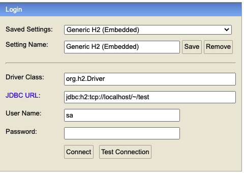

# 스프링 DB 접근 기술 


## H2 데이터베이스 설치

개발이나 테스트 용도로 가볍고 편리한 DB, 웹 화면 제공 

[h2데이터베이스](https://www.h2database.com/html/main.html) 에서 다운받기

압축해제 후 h2/bin 에서 h2.sh 있는지 확인 

mac은 권한을 줘야함 

```bash
$ chmod 755 h2.sh
```

실행하는방법

```bash
$ ./h2.sh
```

실행후 웹페이지창이 켜지면 URL을 localhost로 변경 

`http://localhost:8082/...`


데이터 베이스 생성방법

`~/test.mv.db ` 파일 생성확인 


JDBC URL 변경 jdbc:h2:tcp://localhost/~/test



### 테이블 생성하기

테이블 관리를 위해 프로젝트 루트에 `sql/ddl.sql ` 생성

```sql
drop table if exists member CASCADE;
create table member
(
    id  bigint generated by default as identity,
    name varchar(255),
    primary key (id)
);
```

h2 데이터베이스에 접근해서 member 테이블 생성하면 끝


## 순수 Jdbc

> 선조의 DB 연결방법, 요즘은 잘안쓴다 


**환경설정**

build.gradle  > dependencies에 추가

```java
implementation 'org.springframework.boot:spring-boot-starter-web'
implementation 'org.springframework.boot:spring-boot-stater-jdbc'
```

resources/application.properties에 추가

```java
spring.datasource.url=jdbc:h2:tcp://localhost/~/test
spring.datasource.driver-class-name=org.h2.Driver
```


## 스프링 jdbcTemplate

- 순수 Jdbc와 동일한 환경설정을 하면된다.
- 스프링 jdbcTemplate 과 MyBatis 같은 라이브러리는 JDBC API에서 본 반복 코드를 대부분 제거해준다. 하지만 SQL은 직접 작성해야함 


**스프링 JdbcTemplate 회원 리포지토리**

```java
package hello.hellospring.repository;

import hello.hellospring.domain.Member;
import org.springframework.beans.factory.annotation.Autowired;
import org.springframework.jdbc.core.JdbcTemplate;
import org.springframework.jdbc.core.RowMapper;
import org.springframework.jdbc.core.namedparam.MapSqlParameterSource;
import org.springframework.jdbc.core.simple.SimpleJdbcInsert;

import javax.sql.DataSource;
import java.sql.ResultSet;
import java.sql.SQLException;
import java.util.HashMap;
import java.util.List;
import java.util.Map;
import java.util.Optional;

public class JdbcTemplateMemberRepository implements MemberRepository {

    private final JdbcTemplate jdbcTemplate;

    public JdbcTemplateMemberRepository(DataSource dataSource) {
        jdbcTemplate = new JdbcTemplate(dataSource);
    }

    @Override
    public Member save(Member member) {
        SimpleJdbcInsert jdbcInsert = new SimpleJdbcInsert(jdbcTemplate);
        jdbcInsert.withTableName("member").usingGeneratedKeyColumns("id");

        Map<String, Object> parameters = new HashMap<>();
        parameters.put("name", member.getName());

        Number key = jdbcInsert.executeAndReturnKey(new MapSqlParameterSource(parameters));
        member.setId(key.longValue());
        return member;
    }

    @Override
    public Optional<Member> findById(Long id) {
        List<Member> result = jdbcTemplate.query("select * from member where id = ?", memberRowMapper(),id);
        return result.stream().findAny();
    }

    @Override
    public Optional<Member> findByName(String name) {
        List<Member> result = jdbcTemplate.query("select * from member where name = ?", memberRowMapper(),name);
        return result.stream().findAny();
    }

    @Override
    public List<Member> findAll() {
        return jdbcTemplate.query("select * from member", memberRowMapper());
    }

    private RowMapper<Member> memberRowMapper(){
        return (rs, rowNum) -> {
            Member member = new Member();
            member.setId(rs.getLong("id"));
            member.setName(rs.getString("name"));
            return member;
        };
    }
}
```


**repository 변경** 

service/ SpringConfig

```java
package hello.hellospring.service;

import hello.hellospring.repository.JdbcTemplateMemberRepository;
import hello.hellospring.repository.MemberRepository;
import hello.hellospring.repository.MemoryMemberRepository;
import org.springframework.beans.factory.annotation.Autowired;
import org.springframework.context.annotation.Bean;
import org.springframework.context.annotation.Configuration;

import javax.sql.DataSource;

@Configuration
public class SpringConfig {

    // spring bean에 service랑 repo 등록
    private DataSource dataSource;

    @Autowired
    public SpringConfig(DataSource dataSource) {
        this.dataSource = dataSource;
    }


    @Bean
    public MemberService memberService() {
        return new MemberService(memberRepository());
    }

    @Bean
    public MemberRepository memberRepository() {

//        return new MemoryMemberRepository();
        return new JdbcTemplateMemberRepository(dataSource);
    }
}
```

## JPA

- JPA는 기존의 반복 코드는 물론이고, 기본적인 SQL도 JPA가 직접 만들어서 실행해준다.
- JPA를 사용하면, SQL과 데이터 중심의 설계에서 객체 중심의 설계로 패러다임을 전환을 할 수 있다.
- JPA를 사용하면 개발 생산성을 크게 높일 수 있다.


**build.gradle 파일에 JPA,h2 데이터 베이스 관련 라이브러리 추가** 

```java
dependencies {
   ...
// implementation 'org.springframework.boot:spring-boot-starter-jdbc'
   implementation 'org.springframework.boot:spring-boot-starter-data-jpa'
   runtimeOnly 'com.h2database:h2'
   ...
}
```

**스프링 부트에 JPA 설정 추가 (resources/application.properties)**

```
# database
spring.datasource.url=jdbc:h2:tcp://localhost/~/test
spring.datasource.driver-class-name=org.h2.Driver
#jpa
spring.jpa.show-sql=true
spring.jpa.hibernate.ddl-auto=none
```

show-sql : jpa가 생성하는 SQL 출력

ddl-auto: jpa는 테이블을 자동으로 생성하는 기능을 제공하는데 none 을 사용하면 해당 기능을 끈다.

​	create를 사용하면 엔티티 정보를 바탕으로 테이블도 직접 생성해준다 


**JPA 엔티티 매핑** (domain/Member)

```java
package hello.hellospring.domain;

import javax.persistence.*;

@Entity
public class Member {

    @Id @GeneratedValue(strategy = GenerationType.IDENTITY)
    private Long id;

//    @Column(name="username")
    private String name;

    public String getName() {
        return name;
    }

    public void setName(String name) {
        this.name = name;
    }

    public Long getId() {
        return id;
    }

    public void setId(Long id) {
        this.id = id;
    }
}
```

Entity mapping 과 

id값은 자동으로 처리하게끔 어노테이션 GeneratedValue까지 


repository 생성 

JPa 는 EntityManager가 알아서 해주는 부분이 많음 

```java
package hello.hellospring.repository;

import hello.hellospring.domain.Member;

import javax.persistence.EntityManager;
import javax.persistence.TypedQuery;
import java.util.List;
import java.util.Optional;

public class JpaMemberRepository implements MemberRepository {

    private final EntityManager em;

    public JpaMemberRepository(EntityManager em) {
        this.em = em;
    }


    @Override
    public Member save(Member member) {
        em.persist(member);
        return member;
    }

    @Override
    public Optional<Member> findById(Long id) {
        Member member = em.find(Member.class, id);
        return Optional.ofNullable(member);
    }

    @Override
    public Optional<Member> findByName(String name) {
        List<Member> result = em.createQuery("select m from Member m where m.name = :name", Member.class)
                .setParameter("name",name)
                .getResultList();

        return result.stream().findAny();
    }

    @Override
    public List<Member> findAll() {
        return em.createQuery("select m from Member m", Member.class)
                .getResultList();
    }
}
```

JPA 연결(SpringConfig)

```java
package hello.hellospring.service;

import hello.hellospring.repository.JdbcTemplateMemberRepository;
import hello.hellospring.repository.JpaMemberRepository;
import hello.hellospring.repository.MemberRepository;
import hello.hellospring.repository.MemoryMemberRepository;
import org.springframework.beans.factory.annotation.Autowired;
import org.springframework.context.annotation.Bean;
import org.springframework.context.annotation.Configuration;

import javax.persistence.EntityManager;
import javax.sql.DataSource;

@Configuration
public class SpringConfig {

    // spring bean에 service랑 repo 등록
//    private DataSource dataSource;
//
//    @Autowired
//    public SpringConfig(DataSource dataSource) {
//        this.dataSource = dataSource;
//    }
    private EntityManager em;

    public SpringConfig(EntityManager em) {
        this.em = em;
    }

    @Bean
    public MemberService memberService() {
        return new MemberService(memberRepository());
    }

    @Bean
    public MemberRepository memberRepository() {

//        return new MemoryMemberRepository();
//        return new JdbcTemplateMemberRepository(dataSource);
        return new JpaMemberRepository(em);
    }

}
```

## 스프링 데이터 JPA

리포지토리에 구현 클래스 없이 인터페이스 만으로 개발을 완료할 수 있다. 

반복개발해온 기본 CRUD 기능도 스프링 데이터 JPA가 모두 제공함 

스프링 데이터 JPA는 JPA를 편리하게 사용하도록 도와주는 기술. 따라서 JPA를 먼저 학습한 후에 스프링 데이터 JPA를 학습하자 

jpa 설정은 그대로 


스프링 데이터 JPA 제공 기능 

- 인터페이스를 통합 기본적인 CRUD
- findByName() , findByEmail() 처럼 메서드 이름 만으로 조회 기능 제공
- 페이지 기능 자동 제공 


**스프링데이터레포지토리를 인터페이스로 만들기**

SpringDataJpaMemberRepository

```java
package hello.hellospring.repository;

import hello.hellospring.domain.Member;
import org.springframework.data.jpa.repository.JpaRepository;

import java.util.Optional;
//interface니까 extends JPaRepositroy <> + MemberRepository 가능 
public interface SpringDataJpaMemberRepository extends JpaRepository<Member, Long>, MemberRepository {

    @Override
    Optional<Member> findByName(String name);
}
```

springConfig

```java
@Configuration
public class SpringConfig {
    private final MemberRepository memberRepository;

    public SpringConfig(MemberRepository memberRepository) {
        this.memberRepository = memberRepository;
    }

    @Bean
    public MemberService memberService() {
        return new MemberService(memberRepository);
    }
```

