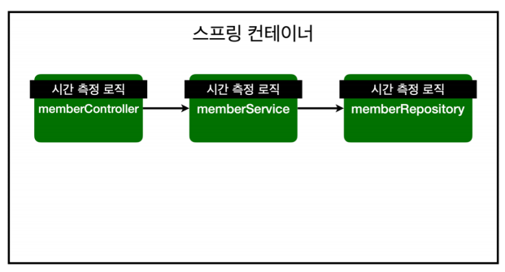
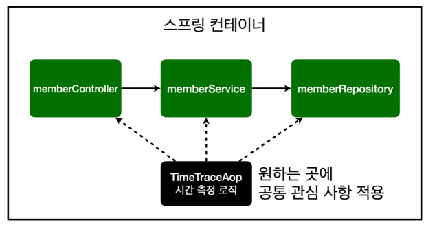
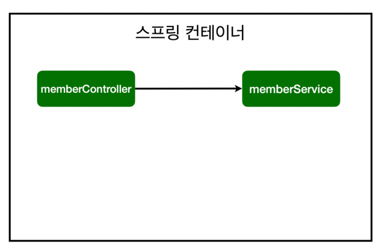
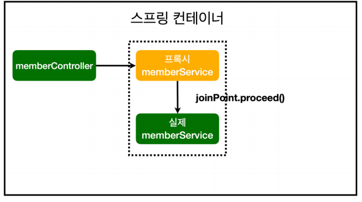
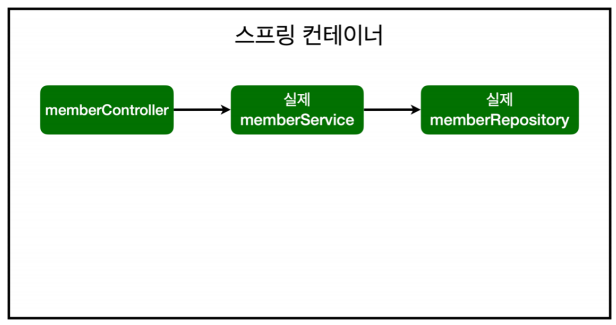
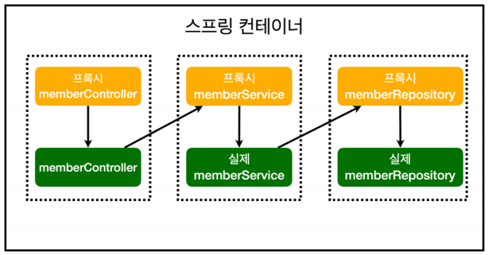

## AOP

### AOP가 필요한 상황

* 모든 메소드의 호출 시간을 측정하고 싶다면?
* 공통 관심 사항(cross-cutting concern) vs 핵심관심사항(core concern)
* 회원 가입시간, 회원 조회 시간을 측정하고 싶다면?



**[MemberService 회원 조회 시간 측정 추가]**

```java
package hello.hellospring.service;
@Transactionalpublic class MemberService {
 /**
 * 회원가입
 */
 public Long join(Member member) {
 long start = System.currentTimeMillis();
 try {
	 validateDuplicateMember(member); //중복 회원 검증
	 memberRepository.save(member);
	 return member.getId();
 } finally {
	 long finish = System.currentTimeMillis();
	 long timeMs = finish - start;
	 System.out.println("join " + timeMs + "ms");
	 }
 }
 /**
 * 전체 회원 조회
 */
 public List<Member> findMembers() {
 long start = System.currentTimeMillis();
 try {
 	return memberRepository.findAll();
 } finally {
 long finish = System.currentTimeMillis();
 long timeMs = finish - start;
 	System.out.println("findMembers " + timeMs + "ms");
 		}
	}
}
```

**문제**

* 회원가입, 회원 조회에 시간을 측정하는 기능은 핵심 비즈니스 로직과 관련이 없음!
* 그냥 공통 관심 사항일뿐,,,, 근데 핵심 비즈니스랑 섞여서 유지보수도 어렵고 시간을 많이 잡음
* 만약 이를 변경하려면,,,,, 다시 한땀한땀 수정해야함....

**해결? AOP를 사용하자!!!**


### AOP 적용

* AOP : Aspect Oriented Programming
* 공통 관심 사항(cross-cutting concern) vs 핵심관심사항(core concern) 분리



**[시간측정 AOP 등록]**

```java
package hello.hellospring.aop;

import org.aspectj.lang.ProceedingJoinPoint;
import org.aspectj.lang.annotation.Around;
import org.aspectj.lang.annotation.Aspect;
import org.springframework.stereotype.Component;

@Component
@Aspect
public class TimeTraceAop {

    @Around("execution(* hello.hellospring..*(..))")
    public Object execute(ProceedingJoinPoint joinPoint) throws Throwable{
        long start = System.currentTimeMillis();
        System.out.println("START: " + joinPoint.toString());
        try {
            return joinPoint.proceed();
        } finally {
            long finish = System.currentTimeMillis();
            long timeMs = finish - start;
            System.out.println("END: " + joinPoint.toString() + " " + timeMs + "ms");
        }
    }


}

```

* 회원가입, 회원 조회등 핵심 관심 사항과 시간을 측정하는 공통 관심사항을 분리한다.
* 시간을 측정하는 로직을 별도의 공통 로직으로 만들어 놓고 사용
* 핵심 관심사항을 유지하기에 편함
* 변경할때도 이것만 해주면 되서 편함
* 원하는대로 적용대상을 선택할 수 있다.

**[스프링 AOP 동작 방식]**

**AOP 적용 전 의존관계**



**AOP 적용 후 의존 관계**

* 프록시 서버가 먼저 올라가서 여기에 AOP가 실행되고나서 실제 서비스가 진행




**AOP 적용 전 전체 그림**



**AOP 적용 후 전체 그림**



