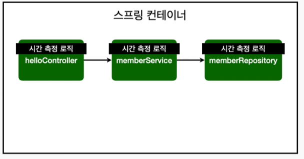
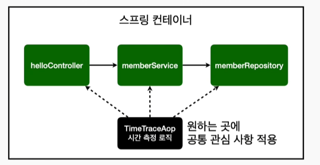
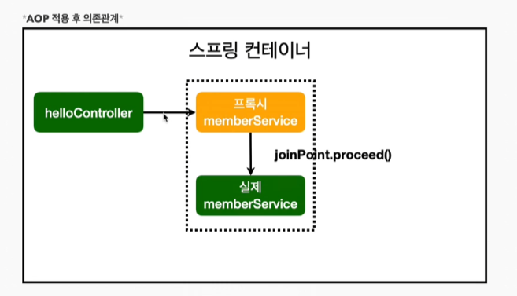
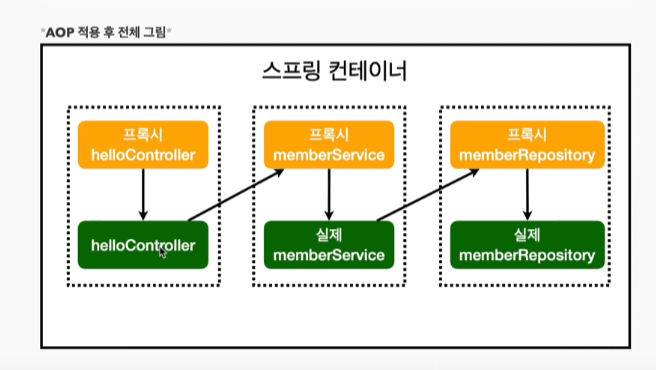

# AOP

## AOP가 필요한 상황

- 모든 메소드의 호출 시간을 측정하고 싶다면?
- 공통 관심 사항 vs 핵심 관심 사항
- 회원 가입 시간, 회원 조회 시간을 측정하고 싶다면 ? 



**MemberService 회원 조회 시간 측정 추가**

```java
/* 회원가입 */
public Long join(Member member){
    long start = System.currentTimeMillis();

    try {
        validateDuplicateMember(member); // 같은 이름이 있는 중복 회원은 안된다.
        memberRepository.save(member);
        return member.getId();
    }finally {
        long finish = System.currentTimeMillis();
        long timeMs = finish -start;
        System.out.println("timeMs = " + timeMs +"ms") ;
    }


}
```

**문제**

- 회원가입,회원 조회에 시간을 측정하는 기능은 핵심 관심 사항이 아니다.
- 시간을 측정하는 로직은 공통 관심 사항이다.
- 로직이 섞여서 유지보수가 어려워진다 .
- 로직을 별도의 공통의 로직으로 만들기 어렵다 
- 모든 로직을 찾아가면서 변경해야 한다.


## AOP 적용

- AOP: Aspect Oriented Programming
- 공통 관심사항 과 핵심 관심 사항 분리 




**시간 측정 AOP 등록** 

```java
package hello.hellospring.aop;


import org.aspectj.lang.ProceedingJoinPoint;
import org.aspectj.lang.annotation.Around;
import org.aspectj.lang.annotation.Aspect;
import org.springframework.stereotype.Component;

@Aspect
@Component
public class TimeTraceAop {

    @Around("execution(* hello.hellospring..*(..))")
    public Object execute(ProceedingJoinPoint joinPoint) throws Throwable{
        long start = System.currentTimeMillis();
        System.out.println("START = " + joinPoint.toString());
        try {

            Object result = joinPoint.proceed();
            return result;
        }finally {
            long finish = System.currentTimeMillis();
            long timeMs = finish - start;
            System.out.println("END = " + joinPoint.toString()+" " + timeMs + "ms");
        }
    }
}
```

- 공통 관심 사항 분리
- 시간을 측정하는 로직을 별도이 공통 로직으로 만듬
- 핵심 관심 사항을 깔끔하게 유지
- 변경이 필요하면 이로직만 변경 가능
- 원하는 적용 대상 선택 가능 







